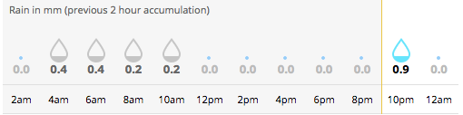
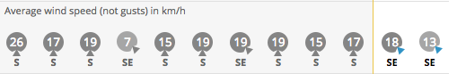

<h1 align="center">Met-Server (* <em>currently-active</em> *)</h1>

_Met-Server is an api-endpoint that returns weather data as JSON that has been scraped from `metservice.com`_

End-points
===========
- Wellingon Weather
  - GET: `https://met-server-nz.herokuapp.com/api/v1/wgtn`
  - Queries database for latest data returned from scrape
  - returns: JSON (eg below)
  ```json
  {
    "date": "Dec 25",
    "weather": "sunny",
    "maxTemp": "21˚C",
    "maxTemp": "14˚C",
  }
  ```

## Why?
- From 5 minutes searching the web I didn't find a metservice API. So I wanted to roll my own.
- I like scraping. The web has many things, we can access these things programmatically.
- I like the request/response pattern. Async is javascript at its best.
- I absolutely love weather chat.

## How?
- Met-Server is a **node.js** webserver hosted on **Heroku** that responds to GET requests with JSON.

- Met-Server uses **Nightmare.js**(headless browser) to scrape the Metservice website. **Cheerio.js** to parse the response html and **Pg-promise** to store the latest weather data in a **Postgres** database.

- The headless browser script is triggered regularly by a chron-job to ensure that the data that is stored and served by the endpoint is up-to-date.

## When?
- Met-Server scrapes Metservice 3 times a day at **06:30**, **10:30** and **16:30** (NZT)

## What (comes next)?
- Teach nightmare to scrape more accurate rain data



- Teach nightmare to scrape wind data



- Learn and use best practises for protecting endpoints

- provide endpoints for more than just latest data. Historical data, data from specific dates. etc
